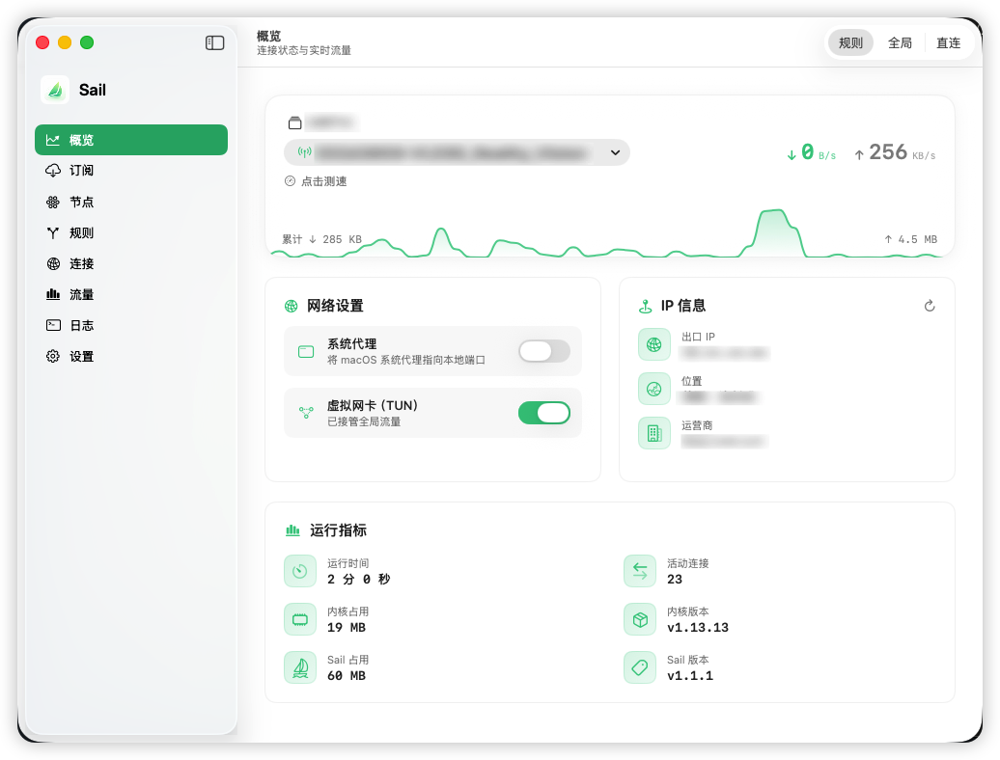

<div align="center">

# Sail ⛵️

**原生 macOS 的 [sing-box](https://github.com/SagerNet/sing-box) 代理客户端**

系统代理/TUN · 订阅管理 · 规则分流 · 实时流量/连接 · 延迟测速

<p>
  <a href="https://github.com/unreadcode/sail/stargazers"></a>
  <a href="https://github.com/unreadcode/sail/network/members"></a>
  <a href="https://github.com/unreadcode/sail/releases/latest"></a>
  <a href="https://github.com/unreadcode/sail/releases"></a>
  <a href="https://github.com/unreadcode/sail/issues"></a>
  <a href="LICENSE"></a>
  
</p>

[English](README.md) | **简体中文**



</div>

---

## 系统要求

- macOS 14.0+
- Apple 芯片（arm64）。不支持 Intel。

## 安装

1. 到 [Releases](https://github.com/unreadcode/sail/releases) 下载最新的 `Sail.dmg`，打开后把 **Sail** 拖进「应用程序」。
2. 首次打开时，在终端执行一行命令以允许运行：

   ```bash
   xattr -dr com.apple.quarantine /Applications/Sail.app
   ```

   之后双击正常打开（每次更新后同样执行一次即可）。

> 本应用采用 ad-hoc 签名而非 Apple 公证，故 macOS Gatekeeper 默认会拦截下载的副本，上述命令用于解除该限制。也可在被拦后前往「系统设置 → 隐私与安全性」点「仍要打开」。源码完全公开，欢迎审阅与自行构建。

## 从源码构建

```bash
git clone https://github.com/unreadcode/sail.git
cd sail

# 1) 拉取并内置 sing-box 内核 + geo 规则集（二进制/数据不入库，按需在线获取）
scripts/fetch-kernel.sh
scripts/fetch-georules.sh

# 2) 构建
xcodebuild -project Sail.xcodeproj -scheme Sail -configuration Debug \
  -derivedDataPath build/Debug-dd build

# 或一键出 DMG（自动 fetch-kernel + fetch-georules → Release → 打包）
scripts/make-dmg.sh
```

> 若在 Xcode 里直接 Build 而没先跑 `fetch-kernel.sh`，构建会**报错提示**（守卫脚本阶段），不会静默打出无内核的包。

## 自动更新

app 启动时静默检查 GitHub 最新 release，有新版会在**托盘菜单**和**设置 → 关于**提示。点「更新」即**一键下载并安装**——自动下载、替换、重启，全程无需手动操作。

> 应用内更新由程序自取，不带隔离属性，所以**不需要再跑 `xattr` 命令**（那行只在你首次从浏览器下载时需要）。

## 致谢

- 内核：[SagerNet/sing-box](https://github.com/SagerNet/sing-box)
- GEO 规则集：[sing-geosite](https://github.com/SagerNet/sing-geosite) / [sing-geoip](https://github.com/SagerNet/sing-geoip)

## 许可

[GPL-3.0](LICENSE) © 2026 Unreadcode

本项目及其衍生作品在分发时均须以 GPL-3.0 开放源码。内置的 sing-box 以独立进程调用，沿用其自身的 GPL-3.0 许可。
